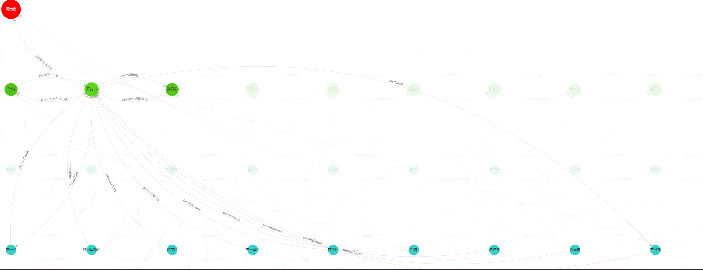

# One Node

A DOM-like data structure

## Install
```bash
npm install one-node --save
```

## Example

Node relationship diagram



```typescript
import { createNode, OneNode } from 'one-node';

const windy = createNode({
  name: 'Windy',
  age: 20,
});
windy.get('age'); // Output: 20
windy.get('name'); // Output: "Windy"

const diluc = createNode({
  name: 'Diluc',
  age: 28,
});

const klee = createNode({
  name: 'Klee',
  age: 8,
});

const barbara = createNode({
  name: 'Barbara',
  age: 12,
});

const bennett = createNode({
  name: 'Bennett',
  age: 13,
});

const jean = createNode({
  name: 'Jean',
  age: 23,
});

windy.appendChild(diluc)
  .appendChild(klee)
  .appendChild(barbara);

barbara.appendChild(bennett)
  .appendChild(jean);

diluc.previousSibling; // Output: null
diluc.nextSibling; // Output: klee(OneNode<{ name: string; age: number; }>)
klee.parentNode; // Output: windy(OneNode<{ name: string; age: number; }>)

Array.from(barbara.children); // Output: [bennett, jean]
barbara.firstChild; // Output: bennett
barbara.lastChild; // Output: jean

```
